# Keycloak custom user registration SPI

This repository contains a Keycloak Service Provider Interface (SPI) plugin that implements a custom user registration process. It provides a REST endpoint for user registration and a browser-based OTP flow that uses a mobile number as the username.

## Assignment details

The implementation covers two specific sets of requirements:

**Assignment 1: Custom REST endpoint**
- A `POST /realms/demo/custom-register/register` endpoint.
- Aggregated validation rules returning all errors simultaneously.
- Duplicate checks for usernames and mobile numbers.

**Assignment 2: Mobile OTP registration flow**
- Extends the built-in registration flow using Keycloak's Authenticator and FormAction SPIs.
- Validates the mobile number and generates an OTP.
- Verifies the OTP before presenting the registration form.
- Hides the username and email fields on the form.
- Injects the verified mobile number as the username before user creation.

## Implementation details

The SPI includes several components to handle validation, authentication, and user creation.

### Rate limiter and OTP verification

The `OtpVerificationAuthenticator` manages OTP input and validation. It enforces a rate limit by restricting users to three incorrect attempts. After three failures, the user must restart the flow and request a new OTP. The OTP is stored in the `AuthenticationSessionModel` and expires after five minutes.

### Improved logging techniques

The `LoggingOtpSender` handles OTP delivery by printing generated codes to the Keycloak server logs. It uses the `org.jboss.logging.Logger` interface for direct integration with Keycloak's native logging system. The application uses parameterized log messages (like `logger.debugf`) instead of string concatenation to improve performance and prevent unnecessary string allocation during high-volume registration events. 

### User creation and attribute persistence

The built-in Keycloak form actions were replaced to manage the data flow correctly. The execution priorities are arranged so the `MobileUsernameFormAction` runs first to inject the mobile number as the username. The built-in `RegistrationUserCreation` action creates the user entity. Finally, `CustomProfileValidation` reads the mobile number from the authentication session and saves it as a user attribute. 

### Testing and CI pipeline

The project uses JUnit and Mockito for unit testing. A `mock-maker-subclass` configuration allows Mockito to test `KeycloakSession` objects cleanly on JDK 21+. The `jacoco-maven-plugin` enforces an 80% instruction coverage minimum on all core logic and validation services. A GitHub Actions workflow automatically builds the project and verifies test coverage on pull requests.

## Execution flow

The custom registration process perfectly mirrors the Keycloak Authentication flow hierarchy. The following diagram illustrates how the Keycloak UI execution steps map directly to our custom Java SPI classes and their core methods:

```mermaid
flowchart TD
    subgraph Flow: mobile-otp-registration
        A["<b>Mobile Number Authenticator</b><br/><i>Class: MobileNumberAuthenticator.java</i><br/>Method: action()<br/>- Validates mobile & Generates OTP"]
        
        B["<b>OTP Verification Authenticator</b><br/><i>Class: OtpVerificationAuthenticator.java</i><br/>Method: action()<br/>- Verifies OTP & Enforces limits"]
        
        subgraph Sub-Flow: mobile-otp-registration-form
            direction TB
            C["<b>Mobile Username Form Action</b><br/><i>Class: MobileUsernameFormAction.java</i><br/>Method: validate()<br/>- Injects mobile as username"]
            
            D["<b>Registration User Profile Creation</b><br/><i>Class: RegistrationUserCreation (Native)</i><br/>- Creates user in database"]
            
            E["<b>Custom Profile Validation</b><br/><i>Class: CustomProfileValidation.java</i><br/>Method: success()<br/>- Sets first/last name & mobile attribute"]
            
            F["<b>Custom Password Validation</b><br/><i>Class: CustomPasswordValidation.java</i><br/>Method: success()<br/>- Hashes & saves password"]
            
            C --> D --> E --> F
        end
        
        A -->|"On Success"| B --> |"On Success"| C
    end
```



### Detailed Method Execution

1. **Mobile Number Authenticator** (`MobileNumberAuthenticator.java`)
   - **`authenticate()`**: Renders `mobile-registration.ftl`.
   - **`action()`**: Validates the 10-digit mobile number, checks for existing duplicates in the DB, generates the OTP, and saves the mobile number temporarily via `context.getAuthenticationSession().setAuthNote("mobile_reg_mobile", mobile)`.

2. **OTP Verification Authenticator** (`OtpVerificationAuthenticator.java`)
   - **`authenticate()`**: Renders `otp-verification.ftl`.
   - **`action()`**: Verifies the submitted OTP against the session storage, enforcing the 5-minute expiry and 3-attempt brute-force limit.

3. **Mobile Username Form Action** (`MobileUsernameFormAction.java`)
   - **`validate()`**: Runs immediately upon registration form submission. It retrieves `mobile_reg_mobile` from the session notes and silently injects it into the form payload (`formData.putSingle("username", mobile)`), allowing the username field to be hidden on the frontend.

4. **Registration User Profile Creation** *(Keycloak Native)*
   - Executes the core Keycloak logic to insert the user into the database using the injected mobile number as the permanent username.

5. **Custom Profile Validation** (`CustomProfileValidation.java`)
   - **`validate()`**: Aggregates and returns any First/Last name validation errors.
   - **`success()`**: Once the user is successfully created in step 4, this method updates the user entity with their First and Last Name, and permanently saves the mobile number as a custom user attribute (`user.setSingleAttribute("mobile", mobile)`).

6. **Custom Password Validation** (`CustomPasswordValidation.java`)
   - **`validate()`**: Enforces password complexity rules.
   - **`success()`**: Securely hashes and stores the validated password in the user's credentials via `user.credentialManager().updateCredential()`.


## Build and deployment

1. Build the project using Maven:
   ```bash
   mvn clean package
   ```
2. Copy the resulting JAR file to the Keycloak providers directory:
   ```bash
   cp target/keycloak-custom-registration-1.0.0-SNAPSHOT.jar /path/to/keycloak/providers/
   ```
3. Start Keycloak in development mode:
   ```bash
   bin/kc.sh start-dev
   ```

## Configuration

1. Create a Generic authentication flow named `Mobile OTP Registration`.
2. Add the `Mobile Number Authenticator` and set it to Required.
3. Add the `OTP Verification Authenticator` and set it to Required.
4. Add the `Registration Page` subflow and set it to Required.
5. Inside the subflow, add `Custom Profile Validation`, `Custom Password Validation`, `Mobile Username Form Action`, and `Registration User Creation`. Set all to Required.
6. Bind the flow to the realm's Registration setting.
7. Change the realm's login theme to `mobile-registration`.

Alternatively, use the custom `POST /setup-flow` endpoint included in the REST resource to configure the flow structure programmatically.

## Testing and OTP retrieval

To test the registration flow and retrieve the generated OTPs, you can either:
- **Use the SDK**: Integrate the API with a client application using the Keycloak SDK to process the registration.
- **Use debug logs**: Run the Keycloak server in development mode (`start-dev`) and monitor the terminal or log files. The `LoggingOtpSender` prints the generated OTPs directly to the console for easy retrieval during testing.
